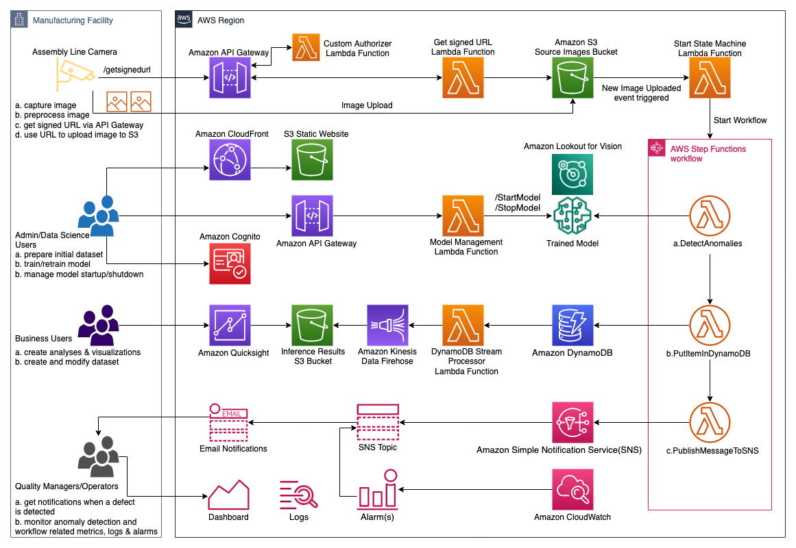

<p align="center">
  
</p>
<h1 align="center">Detect manufacturing defects in real time using Amazon Lookout for Vision</h1>

[Amazon Lookout for Vision](https://aws.amazon.com/lookout-for-vision/) is a machine learning (ML) service that spots defects and anomalies in visual representations using computer vision (CV). With Amazon Lookout for Vision, manufacturing companies can increase quality and reduce operational costs by quickly identifying differences in images of objects at scale. For example, Amazon Lookout for Vision can be used to identify missing components in products, damage to vehicles or structures, irregularities in production lines, miniscule defects in silicon wafers, and other similar problems. Amazon Lookout for Vision uses ML to see and understand images from any camera as a person would, but with an even higher degree of accuracy and at a much larger scale. Amazon Lookout for Vision allows customers to eliminate the need for costly and inconsistent manual inspection, while improving quality control, defect and damage assessment, and compliance. In minutes, you can begin using Amazon Lookout for Vision to automate inspection of images and objects–with no machine learning expertise required.


This sample code helps get you started with a serverless application to upload images, classify them as anomalous or non-anomolous using Amazon Lookout For Vision, store inference results and process them for business insights dashboards as well as send email notifications when an image is classified as anomalous or a low confidence classification is detected.

Features:
* Image upload to S3 using API Gateway and S3 signed URL
* Anomaly Detection using Amazon Lookout For Vision
* Inference results storage using Amazon DynamoDB
* Notifications using Amazon SNS
* Monitoring & Alerting using Amazon CloudWatch

For more details, refer to the [blog post](https://aws.amazon.com/blogs/machine-learning/detect-manufacturing-defects-in-real-time-using-amazon-lookout-for-vision/)

---------------
### Index
---------------

* [Architecture](#architecture)
* [What's Here](#whats-here)
* [Usage](#usage)
  * [Prerequisites](#prerequisites)
  * [Deployment](#deployment)
  * [Deployment using SAM CLI](#deployment-using-sam-cli)
  * [Deploy Management Front End](#deploy-management-front-end)
  * [Testing](#testing)
  * [Setup Quicksight Dashboard](#setup-quicksight-dashboard)
* [Removing the application](#removing-the-application)
* [Contributing](#contributing)
* [Security](#security)
* [License Summary](#license-summary)
---------------
### Architecture
---------------

<p align="center">
  
</p>

The architecture is composed of the following building blocks:
* Image Ingestion and Storage - relies on [Amazon API Gateway](https://aws.amazon.com/api-gateway) and [AWS Lambda](https://aws.amazon.com/lambda) for the API, and  [Amazon S3](https://aws.amazon.com/s3) for image storage
* Image Inference - relies on [Amazon Lookout for Vision](https://aws.amazon.com/lookout-for-vision) for image defect detection
* Defect Detection Workflow - uses [AWS Step Functions](https://aws.amazon.com/step-functions) to orchestrate workflow
* Inference Results Persistence  - uses [Amazon DynamoDB](https://aws.amazon.com/dynamodb) to store inference results
* Analytics - uses [Amazon Kinesis Data Firehose](https://aws.amazon.com/kinesis/data-firehose) to deliver results from DynamoDB to S3 and [Amazon QuickSight](https://aws.amazon.com/quicksight) to create insights dashboards
* Notifications - uses [Amazon Simple Notification Service](https://aws.amazon.com/sns) for sending email notifications to subscribed email address
* Monitoring & Alerting - uses [Amazon CloudWatch](https://aws.amazon.com/cloudwatch) for monitoring workload metrics and alerting using alarms


**Image Ingestion**
The solution flow starts from a camera or compute resource uploading an image by invoking the API to get a signed URL form Amazon S3. Additional metadata is associated with the request e.g. Assembly Line ID, Camera ID. The call to the API is authorized using an authorization token via a custom lambda authorizer function. The signed URL received as part of the response is used to upload the image to a S3 bucket.

**Anomaly Detection Workflow**
As an image lands in the S3 bucket, an event is triggered which invokes a Lambda function to start a Step Functions workflow. The workflow carries out 3 steps:
1. Invoke *DetectAnomalies* API for Lookout For Vision to inference results from the pre-trained model. The response is enriched with metadata associated with the image file such as Camera ID, Assembly Line ID, DateTime, Image ID.
2. A lambda function takes the response and saves it in DynamoDB
3. Another lambda function publishes a message to a SNS Topic based on whether the image has been classified as anomalous or has a low confidence inference result.

**Analytics**
As records are added to DynamoDB, the streams configuration on the table sends NEW records to a stream from where they are read by a Lambda function which transforms the received JSON and then puts the transformed record in Kinesis Firehose Delivery Stream. Kinesis Firehose batches up the received records and stores them in another S3 bucket.
The S3 bucket that stores the results also contains a *manifest.json* file which can be used by QuickSight to identify the data to import from S3 and subsequently create visualizations and dashboards using that.

**Notifications**
Anomaly detection and low-confidence inference results trigger an email notification to be sent via an SNS topic. The topic is subscribed by an email address that can be passed as a parameter to the CloudFromation template.

**Monitoring & Alerting**
Monitoring the state of the workload is managed via CloudWatch - as part of the solution, a dashboard is created which provides a single pane of glass for all metrics related to Lookout For Vision model as well as the Step Functions workflow. Additionally, an alarm is created which triggers whenever detected anomalies exceed a threshold and send sends an email notification via SNS.

---------------
### What's Here
---------------

This sample includes:

* `README.md` - this file
* `functions/` - contains all Lambda functions source code
* `template.yml` - this file contains the AWS Serverless Application Model (AWS SAM) template used by AWS CloudFormation to deploy the application.
* `resources/circuitboard/` - contains images for model training and testing
   * `resources/circuitboard/train/anomaly` - contains anomaly images for model training
   * `resources/circuitboard/train/normal` - contains normal images for model training
   * `resources/circuitboard/test/anomaly` - contains anomaly images for model testing
   * `resources/circuitboard/test/normal` - contains normal images for model testing
   * `resources/circuitboard/extra_images` - contains additional images to use for testing using script
   
* scripts/ - script files for testing functionality

---------------
### Usage
---------------
#### Prerequisites

To setup prerequisites related to Amazon Lookout For Vision, refer to this [link](https://docs.aws.amazon.com/lookout-for-vision/latest/developer-guide/su-set-up.html)

Specifically, you will need to setup the following:

1. AWS Account - If you don’t already have an AWS account, create one at <https://aws.amazon.com> by following the on-screen instructions. Your access to the AWS account must have IAM permissions to launch AWS CloudFormation templates that create IAM roles.
2. Create an IAM administrator user and group
3. Setup permissions
4. Create the console bucket and copy the name for use later
5. Setup [AWS CLI](https://docs.aws.amazon.com/cli/latest/userguide/install-cliv2.html)
6. For local development, you can setup [SAM CLI](https://docs.aws.amazon.com/serverless-application-model/latest/developerguide/serverless-sam-cli-install.html)(Optional)
7. For testing, you require [Python3](https://www.python.org/downloads/)
8. Clone repository
```
git clone https://github.com/aws-samples/amazon-lookout-for-vision-serverless-app.git
```
9. Prepare sample images - you can get started with the images in the repository (../resources/circuitboard/) or prepare your own custom labeled dataset. Refer to [link](https://docs.aws.amazon.com/lookout-for-vision/latest/developer-guide/su-prepare-example-images.html) for more details

If you choose to use the dataset that is part of the repository, then execute the following command after updating details of your S3 bucket to upload the images for training the model in Amazon Lookout for Vision.

```
aws s3 cp --recursive your-repository-folder/resources/circuitboard s3://your-lookout-for-vision-bucket/custom-dataset/circuitboard/
```


10. Get started with Amazon Lookout For Vision - Setup project, create dataset and train model. In your AWS account, train a model in Lookout For Vision using the dataset in *../resources/circuitboard/* or from your own custom dataset. Refer to steps [here](https://docs.aws.amazon.com/lookout-for-vision/latest/developer-guide/getting-started.html) or watch videos [here](https://aws.amazon.com/lookout-for-vision/resources/)

---------------
#### Deployment
---------------
The application is deployed as an [AWS CloudFormation](https://aws.amazon.com/cloudformation) template.

> **Note**  
You are responsible for the cost of the AWS services used while running this sample deployment. There is no additional cost for using this sample. For full details, see the following pricing pages for each AWS service you will be using in this sample.  Prices are subject to change.
> * [Amazon Lookout for Vision Pricing](https://aws.amazon.com/lookout-for-vision/pricing/)
> * [Amazon API Gateway Pricing](https://aws.amazon.com/api-gateway/pricing/)
> * [Amazon S3 Pricing](https://aws.amazon.com/s3/pricing/)
> * [AWS Lambda Pricing](https://aws.amazon.com/lambda/pricing/)
> * [AWS Step Functions Pricing](https://aws.amazon.com/step-functions/pricing/)
> * [AWS Kinesis Firehose Pricing](https://aws.amazon.com/kinesis/data-firehose/pricing/)
> * [AWS DynamoDB Pricing](https://aws.amazon.com/dynamodb/pricing/)
> * [AWS SNS Pricing](https://aws.amazon.com/sns/pricing/)
> * [AWS Quicksight Pricing](https://aws.amazon.com/quicksight/pricing/)


1. Deploy the latest CloudFormation template by following the link below for your preferred AWS region:

|Region|Launch Template|
|------|---------------|
|**US East (N. Virginia)** (us-east-1) | [](https://console.aws.amazon.com/cloudformation/home?region=us-east-1#/stacks/new?stackName=LookoutVisionApp&templateURL=https://solution-builders-us-east-1.s3.us-east-1.amazonaws.com/amazon-lookout-for-vision-serverless-app/latest/template.yml)|
|**US East (Ohio)** (us-east-2) | [](https://console.aws.amazon.com/cloudformation/home?region=us-east-2#/stacks/new?stackName=LookoutVisionApp&templateURL=https://solution-builders-us-east-2.s3.us-east-2.amazonaws.com/amazon-lookout-for-vision-serverless-app/latest/template.yml)|
|**US West (Oregon)** (us-west-2) | [](https://console.aws.amazon.com/cloudformation/home?region=us-west-2#/stacks/new?stackName=LookoutVisionApp&templateURL=https://solution-builders-us-west-2.s3.us-west-2.amazonaws.com/amazon-lookout-for-vision-serverless-app/latest/template.yml)|
|**EU (Ireland)** (eu-west-1) | [](https://console.aws.amazon.com/cloudformation/home?region=eu-west-1#/stacks/new?stackName=LookoutVisionApp&templateURL=https://solution-builders-eu-west-1.s3.eu-west-1.amazonaws.com/amazon-lookout-for-vision-serverless-app/latest/template.yml)|

2. If prompted, login using your AWS account credentials.
3. You should see a screen titled "*Create Stack*" at the "*Specify template*" step. The fields specifying the CloudFormation template are pre-populated. Click the **Next** button at the bottom of the page.
4. On the "*Specify stack details*" screen you may customize the following parameters of the CloudFormation stack:
   * **Stack Name:** (Default: *L4VServerlessApp*) This is the name that is used to refer to this stack in CloudFormation once deployed.
   * **AlertsEmailAddress:** This is the e-mail address used for subscribing to email notifications.
   * **ResourcePrefix:** AWS Resources are named based on the value of this parameter. You must customise this if you are launching more than one instance of the stack within the same account.
   * **LookoutProjectName**  Lookout For Vision Project name
   * **LookoutModelVersion**  (Default: *1*) Lookout For Vision - Model version of the specified project
   * **ConfidenceThresholdForAlerts**  (Default: *0.20*) Threshold value [0.00 - 1.00] for alerting on low confidence inference results
   * **ImageFileExtension**  (*jpeg|jpg|png*) (Default: *jpeg*) Extension type of images that will used for inference - Lookout for Vision supports jpeg/jpg/png

   When completed, click **Next**
5. [Configure stack options](https://docs.aws.amazon.com/AWSCloudFormation/latest/UserGuide/cfn-console-add-tags.html) if desired, then click **Next**.
6. On the review you screen, you must check the boxes for:
   * "*I acknowledge that AWS CloudFormation might create IAM resources*" 
   * "*I acknowledge that AWS CloudFormation might create IAM resources with custom names*"
   * "*I acknowledge that AWS CloudFormation might require the following capability: CAPABILITY_AUTO_EXPAND*"

   These are required to allow CloudFormation to create the IAM roles specified in the CloudFormation using both fixed and dynamic names.
7. Click **Create Change Set**
8. On the *Change Set* screen, click **Execute** to launch your stack.
   * You may need to wait for the *Execution status* of the change set to become "*AVAILABLE*" before the "**Execute**" button becomes available.
9. Wait for the CloudFormation stack to launch. Completion is indicated when the "Stack status" is "*CREATE_COMPLETE*".
   * You can monitor the stack creation progress in the "Events" tab.
10. Note the *url* displayed in the *Outputs* tab for the stack. This is used to request for S3 signed Url to upload an image. The url will be used later in the 'Testing' section.
11. Check the inbox for the 'AlertsEmailAddress' passed as a parameter for an email from Amazon SNS to confirm subscription. Confirm subscription by accessing the link in the email to receive defect detection emails.

---------------
#### Deployment using SAM CLI
---------------

These directions assume you want to develop on your development environment or a Cloud9 environment.

To work on the sample code, you'll need to clone your project's repository to your local computer. If you haven't, do that first.

1. Ensure you have [Python3](https://www.python.org/downloads/) installed
2. Install [SAM CLI](https://docs.aws.amazon.com/serverless-application-model/latest/developerguide/serverless-sam-cli-install.html) 
3. Create a S3 Bucket for storing artefacts e.g. lambda code etc.
4. Deploy the template using SAM CLI commands - run the [sam deploy](https://docs.aws.amazon.com/serverless-application-model/latest/developerguide/sam-cli-command-reference-sam-deploy.html) command in the project root folder. 

**Important Notes** - when replacing the parameters in the command below:
* ensure that the **ResourcePrefix** parameter value is unique for each stack if you want to provision multiple stacks in the same account
* region parameter should be where the Lookout For Vision model has been deployed.

```
sam deploy --template template.yml --region <REGION> --s3-bucket <S3 BUCKET NAME>  --s3-prefix <S3 PREFIX> --capabilities "CAPABILITY_IAM" --parameter-overrides ResourcePrefix=<RESOURCEPREFIX> AlertsEmailAddress=<EMAIL ADDRESS> LookoutProjectName=<PROJECT NAME> LookoutModelVersion=<MODEL VERSION> --stack-name <STACK NAME>

```

Example - deploying in Ireland region (eu-west-1)
```
sam deploy --template template.yml --region eu-west-1 --s3-bucket sam-artefacts --s3-prefix lookoutforvision --capabilities "CAPABILITY_IAM" --parameter-overrides ResourcePrefix=lfv AlertsEmailAddress=abc@xyz.com  LookoutProjectName=lfvproject LookoutModelVersion=1 --stack-name lfv-stack
```

You can also use the guided execution process by using the following command:
```
sam deploy --guided
```

Provide the parameter values as you are prompted to proceed through the provisioning process.

**Troubleshooting**
* if you run into an issue where the resources are not created, or the stack rolls back - then please ensure you are using a random value for the *ResourcePrefix* parameter.

---------------
#### Deploy Management Front End
---------------
The management front end is another sample solution that provides a simple web user inteface to manage your Amazon Lookout for Vision models.

To get started, refer to this [link](https://github.com/aws-samples/amazon-lookout-for-vision-demo) or deploy the latest CloudFormation template by following the link below for your preferred AWS region:

|Region|Launch Template|
|------|---------------|
|**US East (N. Virginia)** (us-east-1) | [](https://console.aws.amazon.com/cloudformation/home?region=us-east-1#/stacks/new?stackName=LookoutVisionDemo&templateURL=https://solution-builders-us-east-1.s3.us-east-1.amazonaws.com/amazon-lookout-for-vision-demo/latest/template.yaml)|
|**US East (Ohio)** (us-east-2) | [](https://console.aws.amazon.com/cloudformation/home?region=us-east-2#/stacks/new?stackName=LookoutVisionDemo&templateURL=https://solution-builders-us-east-2.s3.us-east-2.amazonaws.com/amazon-lookout-for-vision-demo/latest/template.yaml)|
|**US West (Oregon)** (us-west-2) | [](https://console.aws.amazon.com/cloudformation/home?region=us-west-2#/stacks/new?stackName=LookoutVisionDemo&templateURL=https://solution-builders-us-west-2.s3.us-west-2.amazonaws.com/amazon-lookout-for-vision-demo/latest/template.yaml)|
|**EU (Ireland)** (eu-west-1) | [](https://console.aws.amazon.com/cloudformation/home?region=eu-west-1#/stacks/new?stackName=LookoutVisionDemo&templateURL=https://solution-builders-eu-west-1.s3.eu-west-1.amazonaws.com/amazon-lookout-for-vision-demo/latest/template.yaml)|

---------------
#### Testing
---------------
**Ensure you have Python3 installed before proceeding**

Follow the steps below to test functionality:

1. Open terminal/command prompt 
2. Install python 'requests' module - execute command from the repository root folder:
   ```
   pip3 install -t scripts/packages/ requests 
   ```
3. Execute the following command from the repository root folder to test image upload - update the parameter values before proceeding:
   ```
   python3 scripts/uploadImages.py <DIRECTORY> <CAMERA_ID> <ASSEMBLY_LINE_ID> <API_ENDPOINT> <AUTH_TOKEN> <TIME_BETWEEN_REQUESTS>
   ```

Example Inputs:
* DIRECTORY='../resources/circuitboard/extra_images'
* CAMERA_ID='CAM123456'
* ASSEMBLY_LINE_ID='ASM123456'
* API_ENDPOINT='https://XYZ.amazonaws.com/Prod/getsignedurl' (note that this is an output from CloudFormation stack provisioned previously)
* AUTH_TOKEN='allow|deny'
* TIME_BETWEEN_REQUESTS=0|1|2|3|4|5... (in seconds)

For *ALLOWING* authorization to upload:

```
python3 scripts/uploadImages.py resources/circuitboard/extra_images CAM123456 ASM123456 https://XYZ.amazonaws.com/Prod/getsignedurl allow 0

```

For *DENYING* authorization to upload:
```
python3 scripts/uploadImages.py resources/circuitboard/extra_images CAM123456 ASM123456 https://XYZ.amazonaws.com/Prod/getsignedurl deny 0
```

Alternatively, you can also update the parameters in *test.sh* file and execute it via terminal/command prompt
```
sh /path/to/test.sh
```
---------------
#### Setup Quicksight Dashboard
---------------

Refer to the [blog post](https://aws.amazon.com/blogs/machine-learning/detect-manufacturing-defects-in-real-time-using-amazon-lookout-for-vision/) for steps to setup QuickSight resources.

1. To setup QuickSight dashboard for the inference results, subscribe to a standard account via the AWS Console.
2. Grant permissions to QuickSight to access the S3 bucket that stores the inference results. 
3. Create a dataset by  specifying the manifest.json file uri stored in the same S3 bucket.
4. Once dataset is imported, you can build visualizations as required and schedule dataset refresh.

Note: Check output of the CloudFormation stack provisioned previously to identify the bucket and the manifest file URI.

---------------
### Removing the application
---------------
To cleanup the resources provisioned as part of the solution, you will need to carry out the following steps:

1.	Ensure that the source and defects-results S3 buckets are empty – you can either [empty the buckets](https://docs.aws.amazon.com/AmazonS3/latest/userguide/empty-bucket.html) via the console or [move the objects](https://aws.amazon.com/premiumsupport/knowledge-center/move-objects-s3-bucket/) to another bucket.
2.	Delete the CloudFormaton stack
Open the AWS CloudFormation Console, click the **LookoutVisionApp** project then right-click and select "*Delete Stack*". Your stack will take some time to be deleted. You can track its progress in the "*Events*" tab. Once the stack deletion is complete, the status will change from "*DELETE_IN_PROGRESS*" to "*DELETE_COMPLETE*". It will then disappear from the list.

3.	Delete the management front end - follow the steps listed [here](https://github.com/aws-samples/amazon-lookout-for-vision-demo#removing-the-demo-application)
4. Delete the Quicksight [dashboard](https://docs.aws.amazon.com/quicksight/latest/user/deleting-a-dashboard.html), [analysis](https://docs.aws.amazon.com/quicksight/latest/user/deleting-an-analysis.html) and [dataset](https://docs.aws.amazon.com/quicksight/latest/user/delete-a-data-set.html)

## Contributing

Contributions are more than welcome. Please read the [code of conduct](CODE_OF_CONDUCT.md) and the [contributing guidelines](CONTRIBUTING.md).

## Security

See [CONTRIBUTING](CONTRIBUTING.md#security-issue-notifications) for more information.

## License Summary

This library is licensed under the MIT-0 License. See the LICENSE file.


